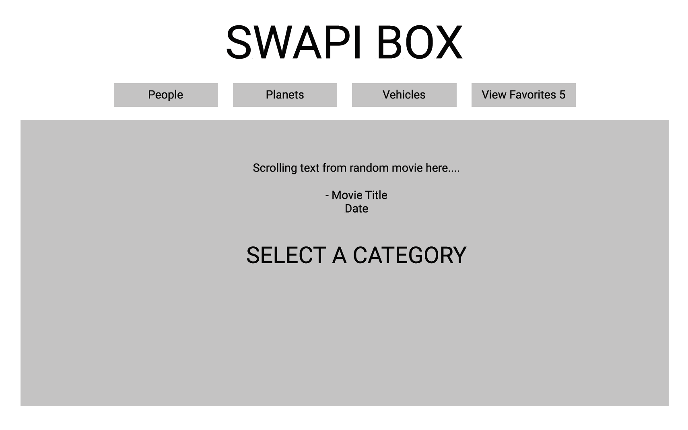
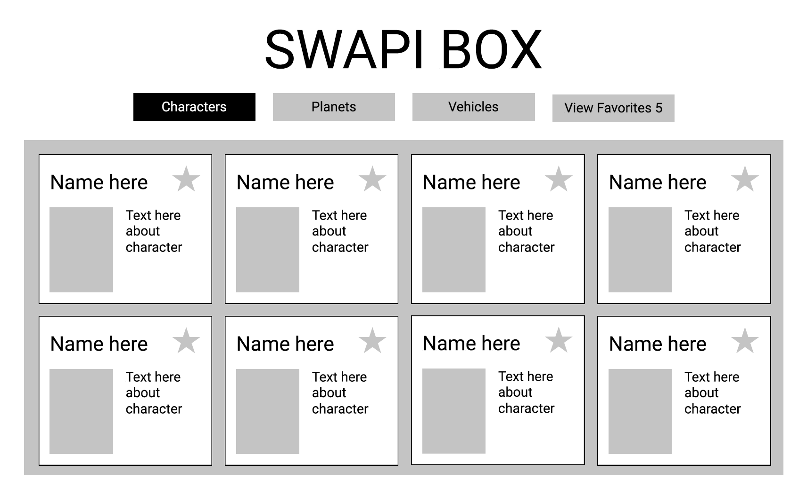

# SWAPI-Box

### [See it Live!](https://kaohman.github.io/swapi-box/)

### Set-Up Front-End:
Clone this repo  
Run `npm install` from the root directory  
Run `npm start` and visit localhost:3000 in your browser

### Background / About:
This app is based on a project to practice React, API fetch calls, and asynchoronous testing with Jest/Enzyme. The project uses the open-source Star Wars API, SWAPI, for all data calls.

### Primary Technologies Used:
 - React
 - Javascript
 - HTML
 - SASS/SCSS
 - Jest/Enzyme

### Test Driven Development:
Jest and Enzyme for front-end testing.  
Run `npm test` from the root directory

### Enhancements:
 - Add radial star animations in background of app.
 - Add more/add less button functionality on cards.
 - Save favorites in local storage.

### Screenshot:

### Original Assignment:
[SWAPI-Box](http://frontend.turing.io/projects/swapi-box.html) project from Turing School of Software and Design

### Contributors:
[Karin Ohman](https://github.com/kaohman)  

### Wireframes:
  

